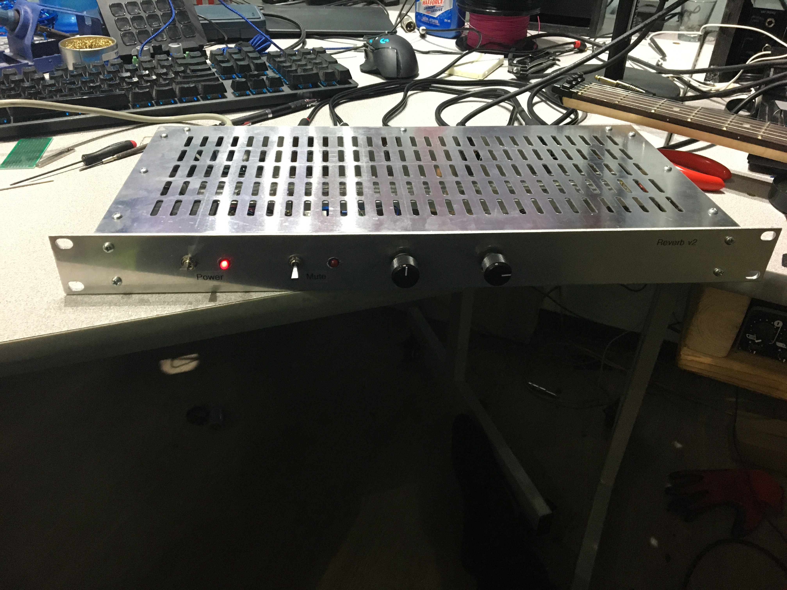
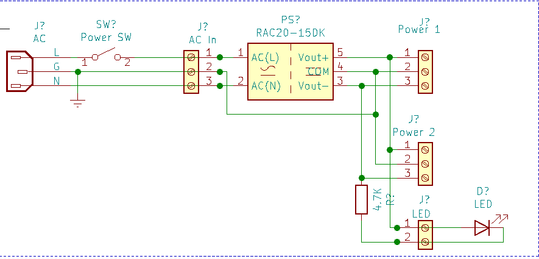
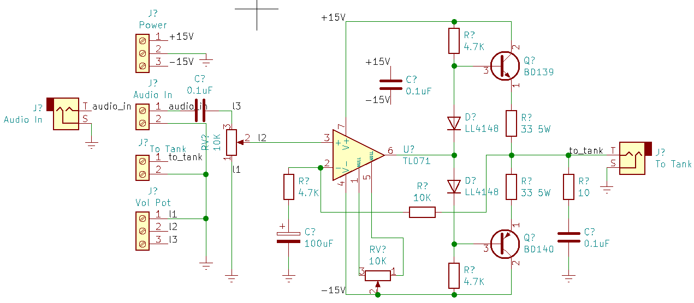
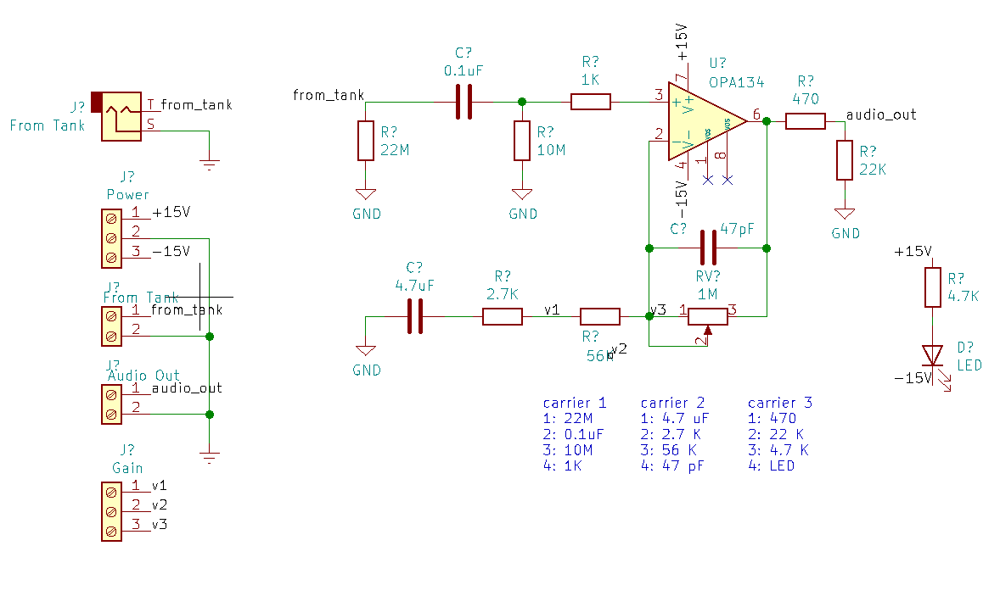
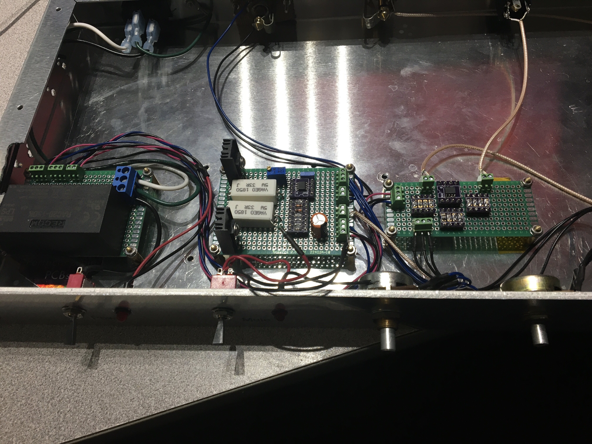
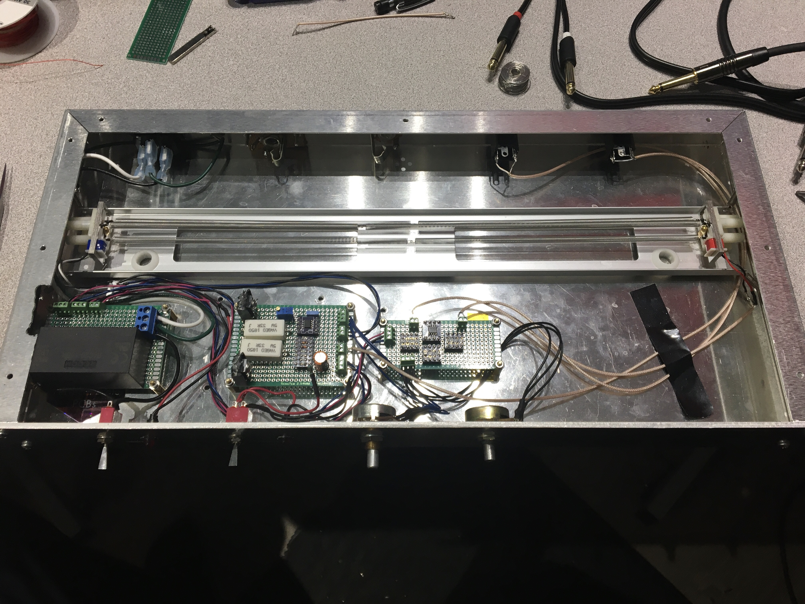

# A second attempt at using op-amps to drive a spring reverb tank

Following the failure of the first attempt and several months, I came back to attempting this again.

This time using some of the knowledge I have learned along the way.

* To use a pre-built power supply module. These Recom power converters are basically cheaper than anything I can build, more efficient, better quality power output, And a single package can not be more convenient.

* To use the simple op-amp that powers a push pull output transistor like I had before for my desktop audio amp and speakers. I mean, here I am driving a spring. it doesn't need to be really good quality hifi audio. It just needs to make the spring move enought that we can pick up its sound.

* To use the boost converter I designed for my guitars. Here this is a v2 design I did a while ago but never got around to actually building, because I didn't need it.

So I set out the Father's day weekend to build 3 small modules.

They fit into the chassis I had used before. So that is good to recycle it.

This time, testing each component as I go on its own.

First I connected the tank on its own. Using my desk audio amplifier to drive it and just sending it back to my mic preamp to hear how it sounds.  The tank on its own is pretty quiet. Good.

I now have a regular speaker, because i built a speaker box. So connecting the reverb tank driver into a speaker to hear how it works. So the driver now works and is not buzzing. Good.  

And the same for the recovery circuit, to connect it to an audio interface and hear what the output of the tank sounds like. And it is not buzzing. Good.

I was even able to mount the spring element back into the chassis, as I originally wanted to do.

## BOM

It works out to around $250

| Part | Link |Cost |
|:--|:--|:--|
| Spring tank | 9AB2C1B | $54 |
| M2.5 standoffs, nuts, washers || $10 |
| 8" 1U rackmount chassis | [Bud Industries](https://www.digikey.ca/product-detail/en/bud-industries/CH-14401/377-1206-ND/428956) | $73 |
| Cover for chassis | [Bud Industries ](https://www.digikey.ca/product-detail/en/bud-industries/C-14431/377-1418-ND/439143) | $31 |
| Potentiometers | [Bourns](https://www.digikey.ca/product-detail/en/bourns-inc/PDA241-SRT02-103A2/PDA241-SRT02-103A2-ND/3781556) | $10 |
| Knobs | [Knurled](https://www.digikey.ca/product-detail/en/kilo-international/OEDL-75-2-5/226-1102-ND/710712) | $22 |
| Jacks | [Mono 6.35mm](https://www.digikey.ca/product-detail/en/switchcraft-inc/L112AX/SC2816-ND/1288931) | $12 |
| Switch | [Toggle](https://www.digikey.ca/product-detail/en/nkk-switches/M2011ES1W01/360-3239-ND/1049310) | $6 |
| Screw terminals | [wire to board](https://www.digikey.ca/product-detail/en/on-shore-technology-inc/OSTVN02A150/ED10561-ND/1588862) | $8 |
| Power Supply | [Recom](https://www.digikey.ca/product-detail/en/recom-power/RAC20-15DK-277/945-RAC20-15DK-277-ND/13890589) | $20 |
| Power connector | [IEC](https://www.digikey.ca/product-detail/en/qualtek/703W-00-02/Q210-ND/245551) | $2 |
